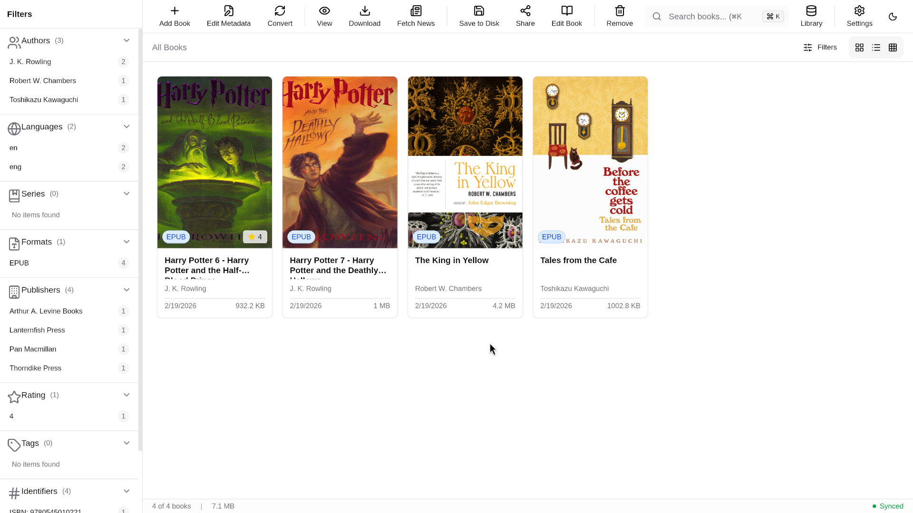
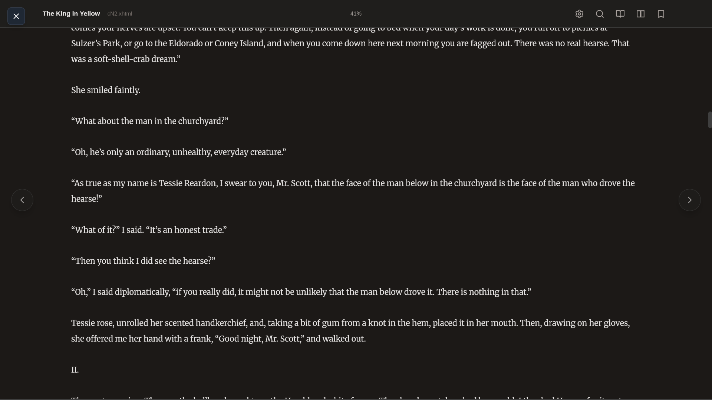
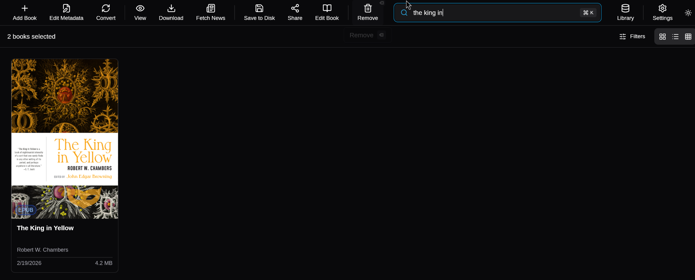
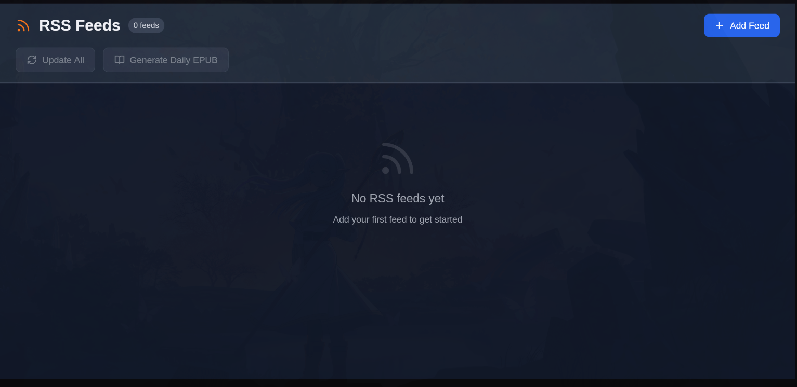
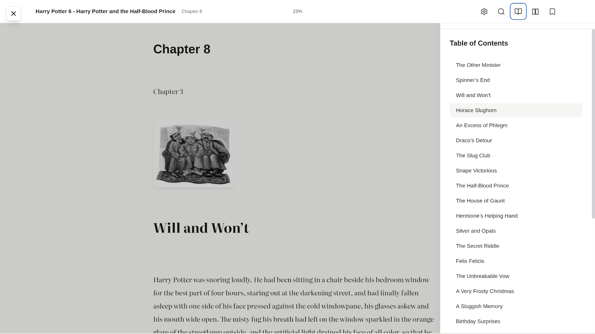
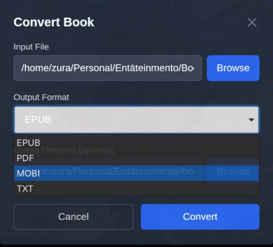

<div align="center">
  
  
  <h1>栞 Shiori</h1>
  <p><strong>Organize, read, and manage your eBook collection</strong></p>
  
  [](https://opensource.org/licenses/MIT)
  [](https://github.com/vinayydv3695/Shiori/releases)
  [](https://tauri.app/)
  [](https://www.rust-lang.org/)
  [](https://react.dev/)
  [](https://www.typescriptlang.org/)
  
  <p>
    <a href="#-key-features">Features</a> •
    <a href="#-screenshots">Screenshots</a> •
    <a href="#-installation">Installation</a> •
    <a href="#-quick-start">Quick Start</a> •
    <a href="#-roadmap">Roadmap</a> •
    <a href="#-contributing">Contributing</a>
  </p>
</div>

---

## 📖 About

**Shiori** (栞, Japanese for "bookmark") is a modern, offline-first eBook library manager built with performance and privacy in mind. Designed for book lovers who want complete control over their digital library, Shiori offers a beautiful, intuitive interface for organizing, reading, and managing eBooks across multiple formats.

Unlike cloud-based alternatives, Shiori keeps your data local, ensures fast performance, and respects your privacy. Built with cutting-edge technologies like Tauri, React, and Rust, it combines native-level performance with a modern web interface.

### Why Shiori?

- **🔒 Privacy First**: All your data stays on your device. No cloud sync, no tracking, no compromises.
- **⚡ Blazingly Fast**: Native performance powered by Rust and Tauri. Launch instantly, search in milliseconds.
- **🎨 Beautiful Design**: Modern, intuitive interface with light/dark themes and customizable reading experience.
- **📚 Multi-Format Support**: Read EPUB, PDF, MOBI, AZW3, DOCX, FB2, CBZ, CBR, and more.
- **🔍 Smart Organization**: Advanced search, metadata editing, tagging, and full-text indexing.
- **🌐 Modern Architecture**: Built with React 19, TypeScript, Tailwind CSS, and SQLite FTS5.

---

## <svg width="24" height="24" viewBox="0 0 24 24" fill="none" xmlns="http://www.w3.org/2000/svg"><path d="M12 2L2 7L12 12L22 7L12 2Z" stroke="currentColor" stroke-width="2" stroke-linecap="round" stroke-linejoin="round"/><path d="M2 17L12 22L22 17" stroke="currentColor" stroke-width="2" stroke-linecap="round" stroke-linejoin="round"/><path d="M2 12L12 17L22 12" stroke="currentColor" stroke-width="2" stroke-linecap="round" stroke-linejoin="round"/></svg> Key Features

### 📚 Library Management
- ✅ **Import eBooks** from local files with automatic metadata extraction
- ✅ **Organize by collections** with tags, ratings, and custom metadata
- ✅ **Advanced search** with full-text indexing (title, author, tags, content)
- ✅ **Metadata editor** for complete control over book information
- ✅ **Duplicate detection** using fuzzy matching and content hashing
- ✅ **Batch operations** for efficient library management

### 📖 Reading Experience
- ✅ **Premium reader** with smooth scrolling and page transitions
- ✅ **Multiple view modes**: Single page, two-page spread, continuous scroll
- ✅ **Dark/Light themes** with customizable reading settings
- ✅ **Table of contents** navigation for easy chapter jumping
- ✅ **Bookmarks and highlights** (coming soon)
- ✅ **Progress tracking** with reading statistics

### 🔍 Smart Features
- ✅ **Full-text search** across your entire library
- ✅ **Keyword highlighting** in search results
- ✅ **Recent books** quick access
- ✅ **Reading history** tracking
- ✅ **Custom sorting** (title, author, date added, last read)

### 🔄 Advanced Capabilities
- ✅ **Format conversion** (EPUB ↔ PDF, with more formats planned)
- ✅ **RSS feed integration** for blogs and web articles
- ✅ **Book sharing** via local network with QR codes
- ✅ **Cover generation** for books without covers
- ✅ **Multi-language support** (UI localization ready)

### 🛠️ Technical Excellence
- ✅ **Offline-first architecture** with no cloud dependencies
- ✅ **SQLite database** with FTS5 full-text search
- ✅ **Virtual scrolling** for handling massive libraries (10,000+ books)
- ✅ **Efficient caching** with LRU and compression
- ✅ **Parallel processing** for CPU-intensive operations
- ✅ **Cross-platform** support (Windows, macOS, Linux)

---

## <svg width="24" height="24" viewBox="0 0 24 24" fill="none" xmlns="http://www.w3.org/2000/svg"><rect x="3" y="3" width="18" height="18" rx="2" stroke="currentColor" stroke-width="2"/><circle cx="8.5" cy="8.5" r="1.5" fill="currentColor"/><path d="M21 15L16 10L5 21" stroke="currentColor" stroke-width="2" stroke-linecap="round" stroke-linejoin="round"/></svg> Screenshots

### Home & Library

<div align="center">
  
  
  <p><em>Light and Dark theme support with beautiful, modern UI</em></p>
</div>

### Reading Experience

<div align="center">
  
  
  <p><em>Immersive reading experience with multiple view modes</em></p>
</div>

### Advanced Features

<div align="center">
  
  
  
  <p><em>Metadata editing, powerful search, and RSS feed integration</em></p>
</div>

<details>
<summary>📸 <strong>View More Screenshots</strong></summary>

### Additional Features

<div align="center">
  
  
  <p><em>Table of contents navigation and format conversion</em></p>
</div>

<div align="center">
  
  
  <p><em>Keyword search and detailed book view</em></p>
</div>

</details>

---

## <svg width="24" height="24" viewBox="0 0 24 24" fill="none" xmlns="http://www.w3.org/2000/svg"><path d="M21 16V8C21 6.89543 20.1046 6 19 6H5C3.89543 6 3 6.89543 3 8V16C3 17.1046 3.89543 18 5 18H19C20.1046 18 21 17.1046 21 16Z" stroke="currentColor" stroke-width="2"/><path d="M12 12H12.01" stroke="currentColor" stroke-width="2" stroke-linecap="round"/></svg> Installation

### Download Pre-built Releases

**🚧 Coming Soon!** Pre-built binaries for Windows, macOS, and Linux will be available in the [Releases](https://github.com/vinayydv3695/Shiori/releases) section.

### Build from Source

#### Prerequisites

Before building Shiori, ensure you have the following installed:

- **Node.js** (v18 or higher) - [Download](https://nodejs.org/)
- **Rust** (1.70 or higher) - [Install via rustup](https://rustup.rs/)
- **System dependencies** for Tauri:
  - **Linux**: `sudo apt install libwebkit2gtk-4.1-dev build-essential curl wget file libssl-dev libayatana-appindicator3-dev librsvg2-dev`
  - **macOS**: Xcode Command Line Tools (`xcode-select --install`)
  - **Windows**: [Microsoft C++ Build Tools](https://visualstudio.microsoft.com/visual-cpp-build-tools/)

#### Build Steps

```bash
# Clone the repository
git clone https://github.com/vinayydv3695/Shiori.git
cd Shiori

# Install dependencies
npm install

# Development mode (with hot reload)
npm run dev

# Build for production
npm run build
```

After building, you'll find the installer in `src-tauri/target/release/bundle/`.

---

## <svg width="24" height="24" viewBox="0 0 24 24" fill="none" xmlns="http://www.w3.org/2000/svg"><path d="M13 2L3 14H12L11 22L21 10H12L13 2Z" stroke="currentColor" stroke-width="2" stroke-linecap="round" stroke-linejoin="round"/></svg> Quick Start

### Adding Your First Book

1. **Launch Shiori** - Open the application after installation
2. **Import Books** - Click the "Add Books" button or drag & drop files into the window
3. **Organize** - Add tags, edit metadata, and create collections
4. **Read** - Double-click any book to start reading

### Keyboard Shortcuts

| Shortcut | Action |
|----------|--------|
| `Ctrl/Cmd + O` | Open/Import books |
| `Ctrl/Cmd + F` | Search library |
| `Ctrl/Cmd + T` | Toggle theme |
| `Ctrl/Cmd + ,` | Open settings |
| `Arrow Keys` | Navigate pages (in reader) |
| `Escape` | Close reader/dialogs |
| `F11` | Toggle fullscreen |

### Importing Your Library

Shiori supports batch imports:

```bash
# Organize your books in folders
Books/
  ├── Fiction/
  ├── Non-Fiction/
  └── Technical/

# In Shiori:
1. File → Import Folder
2. Select your Books directory
3. Shiori will recursively scan and import all supported formats
```

---

## <svg width="24" height="24" viewBox="0 0 24 24" fill="none" xmlns="http://www.w3.org/2000/svg"><circle cx="12" cy="12" r="10" stroke="currentColor" stroke-width="2"/><path d="M12 6V12L16 14" stroke="currentColor" stroke-width="2" stroke-linecap="round"/></svg> Technology Stack

Shiori is built with modern, performant technologies:

### Frontend
- **React 19** - Latest React with improved performance and concurrent features
- **TypeScript** - Type-safe development for fewer bugs
- **Tailwind CSS** - Utility-first CSS for rapid UI development
- **Radix UI** - Unstyled, accessible components
- **TanStack Query** - Powerful asynchronous state management
- **Zustand** - Lightweight state management
- **ePub.js & PDF.js** - Native eBook rendering

### Backend (Rust)
- **Tauri 2.0** - Lightweight, secure desktop app framework
- **SQLite** - Embedded database with FTS5 full-text search
- **Tokio** - Asynchronous runtime for concurrent operations
- **Rusqlite** - Safe, ergonomic SQLite bindings
- **epub-rs** - EPUB parsing and metadata extraction
- **lopdf** - PDF processing and manipulation
- **feed-rs** - RSS/Atom feed parsing

### Key Libraries
- **epub** - EPUB format support
- **lopdf** - PDF processing
- **mobi** - MOBI/AZW3 support
- **docx-rs** - DOCX parsing
- **quick-xml** - FB2/XML parsing
- **image** - Cover generation and manipulation
- **axum** - HTTP server for book sharing
- **qrcode** - QR code generation for sharing

### Architecture Highlights

- **Offline-First**: No network required, all data stored locally
- **FTS5 Search**: Lightning-fast full-text search across all books
- **Virtual Scrolling**: Handle libraries with 10,000+ books smoothly
- **Parallel Processing**: CPU-intensive tasks utilize all cores
- **Smart Caching**: LRU cache with zstd compression for optimal performance
- **Type-Safe IPC**: Rust backend ↔ TypeScript frontend with full type safety

---

## <svg width="24" height="24" viewBox="0 0 24 24" fill="none" xmlns="http://www.w3.org/2000/svg"><path d="M21 15V19C21 20.1046 20.1046 21 19 21H5C3.89543 21 3 20.1046 3 19V15" stroke="currentColor" stroke-width="2" stroke-linecap="round" stroke-linejoin="round"/><polyline points="7 10 12 15 17 10" stroke="currentColor" stroke-width="2" stroke-linecap="round" stroke-linejoin="round"/><line x1="12" y1="15" x2="12" y2="3" stroke="currentColor" stroke-width="2" stroke-linecap="round"/></svg> Roadmap

### ✅ Phase 1A - Core Foundation (Completed)
- [x] Library management (add, view, delete books)
- [x] EPUB & PDF reader with navigation
- [x] Dark/Light theme support
- [x] SQLite database with FTS5 search
- [x] Basic metadata display
- [x] Virtual scrolling for large libraries
- [x] Keyboard shortcuts

### 🚧 Phase 1B - Enhanced Features (In Progress)
- [x] Advanced metadata editor
- [x] Full-text search UI
- [x] Tag management system
- [x] Collection/category organization
- [x] Format conversion (EPUB ↔ PDF)
- [x] RSS feed integration
- [ ] Import/Export library data
- [ ] Reading progress sync

### 📋 Phase 2 - Reader Enhancements (Q2 2026)
- [ ] Bookmarks and highlights
- [ ] Annotations and notes
- [ ] Customizable reading themes
- [ ] Font selection and typography controls
- [ ] Text-to-speech integration
- [ ] Dictionary lookup
- [ ] Reading statistics dashboard
- [ ] Multiple library support

### 📋 Phase 3 - Advanced Features (Q3 2026)
- [ ] Browser extension for web article saving
- [ ] Cloud sync (optional, self-hosted)
- [ ] Mobile companion app (iOS/Android)
- [ ] Advanced duplicate detection
- [ ] Automatic metadata fetching (ISBN lookup)
- [ ] Series detection and organization
- [ ] Reading goals and challenges
- [ ] Export annotations to Markdown/PDF

### 📋 Phase 4 - Community & Polish (Q4 2026)
- [ ] Plugin system for extensibility
- [ ] Custom themes and layouts
- [ ] Community theme marketplace
- [ ] Multi-language UI (i18n)
- [ ] Accessibility improvements (ARIA, screen readers)
- [ ] Performance optimizations
- [ ] Comprehensive documentation
- [ ] Video tutorials

### 🔮 Future Possibilities
- Goodreads integration
- Calibre library import
- E-ink device support
- AI-powered book recommendations
- OCR for scanned documents
- Book lending between users
- Social reading features

---

## <svg width="24" height="24" viewBox="0 0 24 24" fill="none" xmlns="http://www.w3.org/2000/svg"><path d="M17 21V19C17 17.9391 16.5786 16.9217 15.8284 16.1716C15.0783 15.4214 14.0609 15 13 15H5C3.93913 15 2.92172 15.4214 2.17157 16.1716C1.42143 16.9217 1 17.9391 1 19V21" stroke="currentColor" stroke-width="2" stroke-linecap="round" stroke-linejoin="round"/><circle cx="9" cy="7" r="4" stroke="currentColor" stroke-width="2"/><path d="M23 21V19C23 17.9391 22.5786 16.9217 21.8284 16.1716C21.0783 15.4214 20.0609 15 19 15" stroke="currentColor" stroke-width="2" stroke-linecap="round" stroke-linejoin="round"/><path d="M16 3.13C16.8604 3.35031 17.623 3.85071 18.1676 4.55232C18.7122 5.25392 19.0078 6.11683 19.0078 7.005C19.0078 7.89317 18.7122 8.75608 18.1676 9.45768C17.623 10.1593 16.8604 10.6597 16 10.88" stroke="currentColor" stroke-width="2" stroke-linecap="round" stroke-linejoin="round"/></svg> Contributing

We welcome contributions from the community! Whether it's bug reports, feature requests, or code contributions, all help is appreciated.

Please see our [CONTRIBUTING.md](CONTRIBUTING.md) for detailed guidelines on:
- How to report bugs
- How to suggest features
- How to submit pull requests
- Code style and conventions
- Development workflow

**Quick contribution guide:**
1. Fork the repository
2. Create your feature branch (`git checkout -b feature/AmazingFeature`)
3. Commit your changes (`git commit -m 'Add some AmazingFeature'`)
4. Push to the branch (`git push origin feature/AmazingFeature`)
5. Open a Pull Request

---

## <svg width="24" height="24" viewBox="0 0 24 24" fill="none" xmlns="http://www.w3.org/2000/svg"><path d="M14 2H6C5.46957 2 4.96086 2.21071 4.58579 2.58579C4.21071 2.96086 4 3.46957 4 4V20C4 20.5304 4.21071 21.0391 4.58579 21.4142C4.96086 21.7893 5.46957 22 6 22H18C18.5304 22 19.0391 21.7893 19.4142 21.4142C19.7893 21.0391 20 20.5304 20 20V8L14 2Z" stroke="currentColor" stroke-width="2" stroke-linecap="round" stroke-linejoin="round"/><path d="M14 2V8H20" stroke="currentColor" stroke-width="2" stroke-linecap="round" stroke-linejoin="round"/><path d="M16 13H8" stroke="currentColor" stroke-width="2" stroke-linecap="round" stroke-linejoin="round"/><path d="M16 17H8" stroke="currentColor" stroke-width="2" stroke-linecap="round" stroke-linejoin="round"/><path d="M10 9H9H8" stroke="currentColor" stroke-width="2" stroke-linecap="round" stroke-linejoin="round"/></svg> License

This project is licensed under the **MIT License** - see the [LICENSE](LICENSE) file for details.

```
MIT License

Copyright (c) 2026 Shiori Contributors

Permission is hereby granted, free of charge, to any person obtaining a copy
of this software and associated documentation files (the "Software"), to deal
in the Software without restriction, including without limitation the rights
to use, copy, modify, merge, publish, distribute, sublicense, and/or sell
copies of the Software, and to permit persons to whom the Software is
furnished to do so, subject to the following conditions:

The above copyright notice and this permission notice shall be included in all
copies or substantial portions of the Software.
```

---

## <svg width="24" height="24" viewBox="0 0 24 24" fill="none" xmlns="http://www.w3.org/2000/svg"><circle cx="12" cy="12" r="10" stroke="currentColor" stroke-width="2"/><path d="M9.09 9C9.3251 8.33167 9.78915 7.76811 10.4 7.40913C11.0108 7.05016 11.7289 6.91894 12.4272 7.03871C13.1255 7.15849 13.7588 7.52152 14.2151 8.06353C14.6713 8.60553 14.9211 9.29152 14.92 10C14.92 12 11.92 13 11.92 13" stroke="currentColor" stroke-width="2" stroke-linecap="round" stroke-linejoin="round"/><path d="M12 17H12.01" stroke="currentColor" stroke-width="2" stroke-linecap="round" stroke-linejoin="round"/></svg> Support & Community

### Get Help

- **Documentation**: Check our [docs/](docs/) folder for detailed guides
- **Troubleshooting**: See [TROUBLESHOOTING.md](TROUBLESHOOTING.md) for common issues
- **Architecture**: Read [ARCHITECTURE.md](ARCHITECTURE.md) for technical details
- **GitHub Issues**: [Report bugs or request features](https://github.com/vinayydv3695/Shiori/issues)

### Connect with Us

<div align="center">

[](https://github.com/vinayydv3695)
[](mailto:vinayydv343@gmail.com)
[](https://twitter.com/zurasan0)
[](https://discord.gg/36QUhguZ)
[](https://vinayydv.me)
[](https://www.linkedin.com/in/vinay-kumar-69bb35350)

</div>

### Show Your Support

If you find Shiori useful, please consider:
- Starring the repository on GitHub
- Sharing it with fellow book lovers
- Contributing to the project
- Reporting bugs and suggesting features

---

## 🙏 Acknowledgments

Shiori is built on the shoulders of giants. Special thanks to:

- **[Tauri](https://tauri.app/)** - For making cross-platform desktop apps accessible
- **[React](https://react.dev/)** - For the powerful UI framework
- **[Rust Community](https://www.rust-lang.org/)** - For excellent crates and support
- **[Radix UI](https://www.radix-ui.com/)** - For accessible component primitives
- **[epub.js](https://github.com/futurepress/epub.js)** - For EPUB rendering
- **[PDF.js](https://mozilla.github.io/pdf.js/)** - For PDF rendering
- **All contributors** - For making this project better

### Inspired By
- [Calibre](https://calibre-ebook.com/) - The gold standard in eBook management
- [Polar](https://getpolarized.io/) - Modern document manager
- [Koodo Reader](https://github.com/koodo-reader/koodo-reader) - Beautiful eBook reader

---

<div align="center">
  
### 栞 Made with ❤️ for book lovers everywhere

**[⬆ Back to Top](#-shiori)**

</div>
