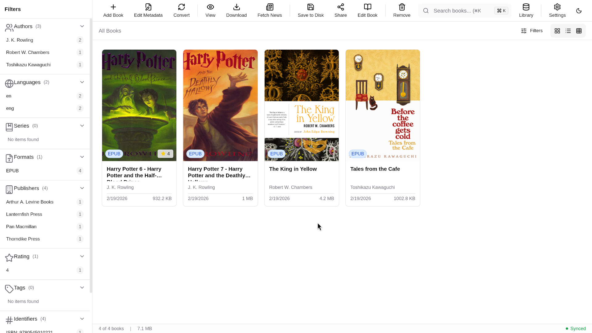
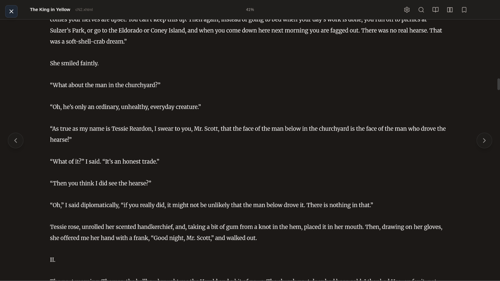
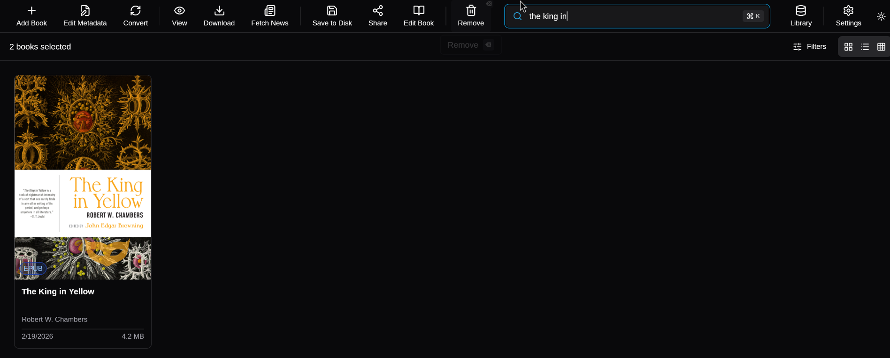
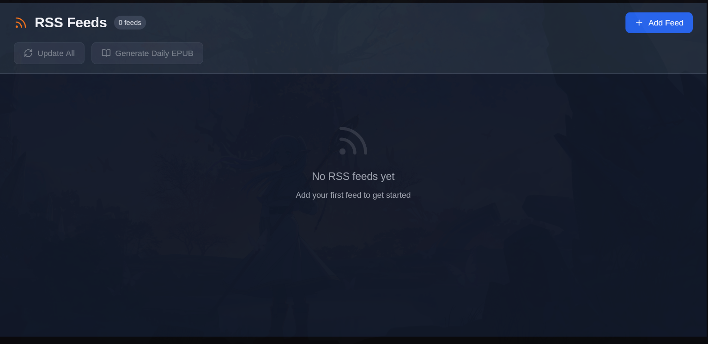
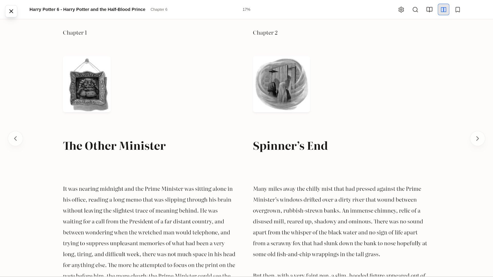

<div align="center">
  

  <h1>Shiori</h1>
  <p><strong>Offline-first desktop library and reading platform for serious personal collections.</strong></p>

  [](https://github.com/vinayydv3695/Shiori/releases)
  [](https://github.com/vinayydv3695/Shiori/actions/workflows/release.yml)
  [](https://aur.archlinux.org/packages/shiorii-bin)
  [](LICENSE)
  [](https://github.com/vinayydv3695/Shiori)

  <p>
    <a href="#product-overview">Overview</a> •
    <a href="#why-shiori">Why Shiori</a> •
    <a href="#feature-showcase">Features</a> •
    <a href="#installation">Installation</a> •
    <a href="#architecture--tech-stack">Architecture</a> •
    <a href="#contributing">Contributing</a>
  </p>
</div>

---

## Product Overview

Shiori is a production-grade desktop application for managing and reading large personal libraries across books, manga, comics, and RSS-fed long-form content. It combines a Rust + Tauri backend with a modern React interface to deliver a fast local-first workflow: import, organize, search, annotate, convert, and read without depending on a cloud account.

The platform is designed around practical reliability: SQLite with FTS5 indexing, versioned migrations, background job persistence, and native packaging for Linux, macOS, and Windows.

> [!NOTE]
> Core library and reading workflows run locally. Online discovery and metadata integrations are optional.

---

## Why Shiori?

| What teams and power users expect | How Shiori delivers |
|---|---|
| Local ownership of data | Library, metadata, covers, and preferences are stored locally in app data. |
| Responsive experience at scale | Virtualized rendering, lazy-loaded views, indexed search, and background workers keep UI interactions fast. |
| Mature reading workflows | Dedicated readers, annotations, translation, dictionary lookup, TTS controls, and progress analytics. |
| Practical extensibility | Source registry architecture with configurable online providers and debrid integration paths. |
| Reliability under change | Schema migrations with rollback safety, persisted conversion jobs, and reproducible multi-platform release workflows. |

---

## Feature Showcase

### Library Management

- Multi-format library support with formats across EPUB, PDF, MOBI, AZW3, DOCX, FB2, TXT, HTML, CBZ, and CBR.
- Import pipelines for books, manga, and comics, with folder scanning and watch-folder automation.
- Metadata tooling: extraction, manual editing, online lookup, ISBN search, and cover preview/application.
- Organization primitives: tags, favorites, collections (including nested and smart collection previews), and domain-aware library views.
- Series operations for manga/comics, including assignment, management dialogs, and auto-grouping workflows.
- Duplicate discovery tools to identify and resolve duplicate entries.
- Backup and restore commands for operational recovery.

### Reader Experience

- Dedicated reading surfaces for EPUB, PDF, MOBI/HTML, plus manga/comic chapter flows.
- Configurable reading preferences for typography, layout, animations, scroll mode, direction, and display density.
- Annotation system with categories, global annotation search, and annotation export.
- Integrated translation popup and dictionary lookup commands for in-context reading support.
- Built-in text-to-speech controls with voice/rate options and playback navigation.
- Reading session telemetry for personal insights: daily time, streaks, per-book stats, and goals.
- Multiple theme options and customizable UI density/scale.

### Search and Indexing

- SQLite FTS5 indexing for fast full-text queries across core library metadata.
- Additional full-text search support for annotations.
- Advanced filtering workflows with structured criteria and saved filter presets.
- Global search routing across library and online content views.
- Command palette and keyboard shortcuts for high-speed, keyboard-driven navigation.

### Performance

- Virtualized library rendering using `@tanstack/react-virtual` for large collections.
- Lazy-loaded routes and dialogs for faster startup and reduced initial UI overhead.
- Conversion engine with queued background workers, cancellation, progress events, and restart-safe job persistence.
- Renderer and cover caching strategies to reduce repeated I/O and improve reader responsiveness.
- Asynchronous Rust services (Tokio) for concurrent metadata, conversion, and content workflows.

### Offline-First and Privacy

- Local-first architecture with no required account and no mandatory cloud sync.
- User preferences default to analytics/crash reporting disabled.
- Strict desktop security posture via Tauri configuration and explicit network allowlists.
- Local share service supports password-protected links, expiration windows, and access limits.
- Password-protected share verification uses Argon2 hashing.

### Online Integrations

- **Open Library**: online book discovery, metadata, covers, and external reading/detail links.
- **MangaDex**: manga search, chapter retrieval, and in-app chapter reader flow.
- **ToonGod**: additional manga source through the source registry.
- **Anna’s Archive connector**: optional plugin source for book discovery and download workflows.
- **Torbox integration**: optional debrid-assisted import flows.
- **AniList + Open Library metadata providers**: online enrichment worker support.
- **RSS ingestion**: feed management, unread tracking, and daily EPUB generation.

> [!IMPORTANT]
> Third-party online sources and connectors may have jurisdictional or service-specific constraints. Users are responsible for compliant usage.

---

## Installation

### Install prebuilt binaries

Download the latest release from:  
**https://github.com/vinayydv3695/Shiori/releases**

| Platform | Distribution | Notes |
|---|---|---|
| Linux (Arch) | `shiorii-bin` / `shiorii-git` (AUR) | Community-maintained AUR packages |
| Linux (Debian/Ubuntu) | `.deb` | Requires WebKitGTK runtime |
| Linux (Fedora/RHEL) | `.rpm` | RPM package available in releases |
| Linux (Universal) | `.AppImage` | Portable binary |
| Windows | `.exe` installer (NSIS) | Standard installer flow |
| macOS | `.dmg` | Intel and Apple Silicon builds |

#### Arch Linux (AUR)

```bash
yay -S shiorii-bin
# or
yay -S shiorii-git
```

#### Debian / Ubuntu

```bash
sudo apt install ./Shiori_<version>_amd64.deb
```

#### Fedora / RHEL

```bash
sudo dnf install ./Shiori-<version>-1.x86_64.rpm
```

#### AppImage

```bash
chmod +x Shiori_<version>_amd64.AppImage
./Shiori_<version>_amd64.AppImage
```

### Build from source

#### Prerequisites

- Node.js 18+
- Rust stable toolchain
- Platform build dependencies for Tauri

Linux build dependencies (Ubuntu example):

```bash
sudo apt update
sudo apt install -y \
  libwebkit2gtk-4.1-dev \
  libappindicator3-dev \
  librsvg2-dev \
  libssl-dev \
  patchelf
```

#### Build steps

```bash
git clone https://github.com/vinayydv3695/Shiori.git
cd Shiori
npm install
npm run dev
```

Production build:

```bash
npm run build
```

---

## Screenshots / Preview

| Library Home | Reader |
|---|---|
|  |  |

| Search & Discovery | RSS Workspace |
|---|---|
|  |  |

| Metadata Editing | Two-Page Reading |
|---|---|
|  |  |

---

## Architecture / Tech Stack

| Layer | Primary Technologies | Responsibility |
|---|---|---|
| Desktop Runtime | Tauri 2, Rust | Native desktop shell, secure IPC, OS packaging |
| Frontend | React 19, TypeScript, Vite | UI composition, view routing, user workflows |
| UI System | Tailwind CSS, Radix UI, Framer Motion | Accessible components, theming, interaction polish |
| State & Data | Zustand, TanStack Query | Local app state and async data orchestration |
| Storage | SQLite + FTS5 | Persistent library state, full-text indexing, metadata relations |
| Reader & Content Services | Rust adapters/renderers | Format detection, rendering, conversion, chapter/content loading |
| Network Services | Reqwest, Axum | Metadata providers, source integrations, local sharing endpoints |
| Delivery | GitHub Actions, Tauri bundling, AUR automation | Multi-platform release and distribution pipeline |

---

## Performance Highlights

| Area | Implementation | Practical Impact |
|---|---|---|
| Large library browsing | Virtualized grid/list rendering | Smooth scrolling and responsive selection on large collections |
| Search responsiveness | SQLite FTS5 indexes and triggers | Fast lookup across metadata and annotation content |
| Conversion throughput | Multi-worker queued conversion engine | Concurrent background conversion without blocking UI |
| Startup and route loading | Lazy-loaded heavy views/dialogs | Faster initial load and reduced startup overhead |
| Reliability on restart | Persisted conversion jobs + restore | Long-running tasks survive app restarts |
| Migration safety | Savepoint-based schema migrations | Lower risk of partial schema corruption during upgrades |
| Onboarding flow | Streamlined setup path | Documented onboarding time reduction in recent releases |

---

## Roadmap / Upcoming Work

The roadmap is actively refined through issues and discussions. Current focus areas include:

- [ ] Complete import-from-export dataset workflow support
- [ ] Continue chunk-size and route-splitting optimizations for heavy views
- [ ] Improve format adapter fidelity (including richer DOCX/FB2/PDF extraction paths)
- [ ] Expand and harden source connector reliability
- [ ] Strengthen RSS-to-library handoff workflows

---

## Contributing

Shiori follows a contributor-friendly workflow with clear quality gates.

1. Fork the repository
2. Create a focused branch (`feat/...`, `fix/...`, `docs/...`)
3. Implement changes with tests or validation steps where applicable
4. Run local checks
5. Open a pull request with a clear problem statement and impact summary

Recommended local checks:

```bash
npm run lint
npm run build
```

For full contributor guidance, review [`CONTRIBUTING.md`](CONTRIBUTING.md).

---

## License

Shiori is released under the [MIT License](LICENSE).

---

## Support

If Shiori is useful to your workflow, star the repository and follow releases.

- Repository: https://github.com/vinayydv3695/Shiori
- Issues: https://github.com/vinayydv3695/Shiori/issues
- Discussions: https://github.com/vinayydv3695/Shiori/discussions
- Releases: https://github.com/vinayydv3695/Shiori/releases

<div align="center">
  <strong>Shiori — local ownership, modern reading workflow, production-grade desktop reliability.</strong>
</div>
