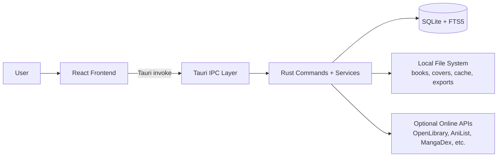

# Shiori Architecture

This document defines technical architecture for Shiori desktop app.

---

## 1) System Overview



Shiori uses a **local-first desktop architecture**:
- UI in React/TypeScript
- Runtime shell + secure IPC in Tauri
- Domain logic in Rust services
- Persistent state in SQLite and local files

---

## 2) Runtime Composition

### Frontend Runtime (`src/`)
- Entry: `src/main.tsx`
- App shell: `src/App.tsx`
- Theming bootstrap: `src/providers/ThemeProvider.tsx`
- API boundary: `src/lib/tauri.ts` (all invoke calls centralized)

### Backend Runtime (`src-tauri/src/main.rs`)
Startup responsibilities:
1. Initialize app-data directories
2. Initialize DB + migrations
3. Register source registry (MangaDex, ToonGod, Nyaa, Bitsearch, 1337x, TPB API, RuTracker, Anna’s Archive)
4. Initialize services:
   - Conversion engine (4 workers)
   - Cover service
   - RSS service + scheduler
   - Share service (HTTP)
   - Metadata worker (AniList + OpenLibrary)
   - Folder watch service
5. Register Tauri commands (`invoke_handler`)

---

## 3) Frontend Architecture

## 3.1 UI Shell
Main shell structure from `Layout`:
- Topbar (`ImprovedToolbar`)
- Navigation rail
- Optional filter sidebar
- Main view content
- Status bar
- Global dialogs + toast system

## 3.2 Navigation Model
Navigation is state-driven (not URL routing).
`useUIStore` controls:
- `currentView` (home, library, annotations, stats, rss, online views, torbox views)
- `currentDomain` (`books` / `manga_comics`)

## 3.3 State Management
Zustand stores separate concerns:
- `libraryStore`: books, filters, pagination, favorites
- `readerStore`: open reader state, annotations, settings, session IDs
- `preferencesStore`: user prefs + per-book/manga overrides
- `onboardingStore`: onboarding wizard and sync to backend
- domain stores (conversion, rss, source, torbox, etc.)

## 3.4 Data Access Pattern
All frontend-to-backend calls go through `api` wrapper (`src/lib/tauri.ts`):
- type-safe command names
- centralized error/log handling
- easier refactor and testing boundary

---

## 4) Backend Architecture

## 4.1 Layering
```text
commands/*     -> validate input + map IPC payloads
services/*     -> domain/business logic
db/*           -> schema init + migrations + pooling
models.rs      -> shared data contracts
sources/*      -> pluggable online providers
utils/*        -> validation, file helpers
```

## 4.2 Command Layer
Command modules expose Tauri callable endpoints:
- library, reader, collections, conversion, rss, share, manga, preferences
- metadata, sources, torbox, translation, backup, folder watch, rendering

## 4.3 Service Layer
Key services:
- `library_service`: import, dedupe, CRUD, domain separation
- `conversion_engine`: queued async jobs + persistent status
- `rss_service` + `rss_scheduler`: feed updates and daily EPUB generation
- `share_service`: local HTTP sharing with expiry/password/access limits
- `metadata worker`: async enrichment + cache + retries
- `folder_watch`: debounced file watching with safe-path restrictions

## 4.4 Source Registry
`SourceRegistry` maps source IDs to `Source` trait implementations.
Each source declares capability metadata and implements search/chapter/page retrieval.

---

## 5) Data Architecture

## 5.1 Storage
- SQLite with `WAL` and connection pool (`r2d2`)
- Books/metadata in DB
- Covers/cache/temp/output in filesystem

## 5.2 Schema + Migrations
- Schema initialization in `db/mod.rs`
- Versioned migrations in `db/migrations.rs` (up to v24)
- Migrations wrapped in savepoints for safe rollback on failure

## 5.3 Core Entity Groups
- Library: `books`, `authors`, `tags`, junction tables
- Reading: `reading_progress`, `annotations`, `annotation_categories`, `reading_sessions`, `reading_goals`
- Organization: `collections`, `collections_books`, `manga_series`
- Jobs + media: `conversion_jobs`, `cover_cache`, `doodles`
- External modules: `rss_feeds`, `rss_articles`, `shares`, `metadata_cache`, onboarding/preferences tables

## 5.4 Search
- `books_fts` (FTS5) with triggers for sync
- `annotations_fts` (FTS5) for global annotation search

---

## 6) Critical Flows

## 6.1 Import Flow
1. Frontend sends selected file paths
2. Backend validates paths and format/domain rules
3. Metadata and hash extracted
4. Duplicate detection by file hash
5. Book + relations inserted in transaction
6. Domain assigned (`books` / `manga` / `comics`)

## 6.2 Reading Flow
1. Open book command resolves file + format
2. Reader/renderer service loads content
3. Progress persisted (with optional EPUB CFI)
4. Sessions tracked via start/heartbeat/end API
5. Annotations stored and indexed

## 6.3 Conversion Flow
1. Job submitted to `ConversionEngine`
2. Job queued and persisted
3. Worker executes conversion (Rust pipeline, Calibre fallback for some paths)
4. Progress events emitted (`conversion:progress`)
5. Final status persisted (completed/failed/cancelled)

## 6.4 Metadata Enrichment Flow
1. Job queued to metadata worker
2. Provider selected by media type
3. Cache checked by query hash
4. Provider fetch with retry/rate-limit handling
5. DB fields updated under offline-first merge rules

---

## 7) Security and Reliability

- Input and path validation in command layer
- Tauri CSP + connect-src allowlist in `tauri.conf.json`
- Share passwords hashed with Argon2
- Expiring/revocable shares with access counting
- DB migration savepoints to prevent half-applied schema
- Persisted conversion jobs for restart recovery
- Folder watch blocks dangerous system directories

---

## 8) Performance Strategy

- SQLite WAL + pooled connections
- FTS5 for fast search
- Lazy-loaded frontend modules for heavy views
- Virtualized list/grid rendering for large libraries
- Async Rust services for I/O and network workloads
- Cache tables/directories for rendered and generated assets

---

## 9) Known Architectural Constraints

- Frontend domain enum uses `manga_comics`, backend stores `manga` and `comics` separately.
- Navigation is state-driven, so deep-linking/bookmarkable URLs are limited.
- Some online providers depend on external uptime, API policy, and region/network constraints.
